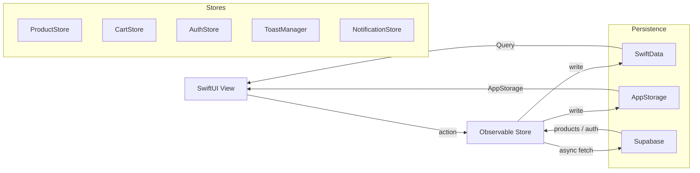

<div align="center">

# GeekCommerz

**Production-grade iOS e-commerce — offline-first, Supabase-ready**

[](https://swift.org)
[](https://developer.apple.com/xcode/swiftui/)
[](https://developer.apple.com/ios/)
[](https://developer.apple.com/xcode/)
[](https://supabase.com)
[](LICENSE)

*Shop smarter. Earn rewards. Track everything.*

</div>

---

## Architecture



```
geekcommerze/
├── Models/          CartItem · Order · OrderItem · Product (Codable)
├── Stores/                CartStore · ProductStore · AuthStore
├── Views/                 14 screens  (+ AuthView)
├── SupabaseService        Nil-safe SupabaseClient singleton
├── ToastManager           Toast banner presenter
├── TabRouter              Programmatic tab-switching store
├── HapticFeedback         UIKit haptic helpers
├── CartAnimationManager   Flying cart particle coordinator
├── NotificationStore
├── AppConfig              All service keys + offline-mode detection
└── AppConstants           All magic values in one place
```

---

## Feature Map

| Screen | Highlights |
|---|---|
| 🔐 **Auth** | Email sign-in · sign-up · password show/hide · email confirmation state · offline bypass |
| 🏠 **Home** | Auto-scroll banner · flash sale countdown · skeleton loading · recently viewed · responsive on iPhone SE |
| 🔍 **Search** | Real-time results · trending chips · recent history (max 8) · category browse |
| 🛒 **Shop** | 2-col grid · sort & filter sheet · long-press context menu · pull-to-refresh |
| 📦 **Product Detail** | Pinch-to-zoom · full-screen 4-slide gallery · color/size variants · size guide sheet (clothing) · 30-day price chart · reviews · collapsible bundle & related sections |
| 🛍 **Cart** | Pill stepper · swipe → wishlist / delete · live shipping threshold · auth gate on checkout (login prompt if Supabase configured and not signed in) |
| 💳 **Checkout** | Saved addresses · promo codes · biometric confirm (passcode fallback) · Apple Pay (demo) · confetti |
| 📋 **Orders** | Status timeline · reorder · return request (persisted) |
| ❤️ **Wishlist** | Heart toggle from any screen · spring-exit on remove · quick-access heart icon in HomeView toolbar |
| 👤 **Profile** | Loyalty tier · address book · dark mode · stats · auth-aware footer: offline notice / Sign In button / Sign Out based on auth state |
| 🔔 **Notifications** | In-app centre · badge · swipe actions · seeded on first launch |
| 🚀 **Splash** | Branded gradient splash on every return launch · skipped on first launch |
| 🎬 **Onboarding** | 3-page flow · shown once on first launch · no splash before it |
| ✨ **Animations** | Cart fly · heart pulse · filter spring · numeric ticker |

---

## Animations

```
Add to Cart tap
     │
     ▼
[bubble pops in] ──arc up──► [drops into cart tab icon] ──► [fades out]

Heart toggle  →  spring pulse 1.0 → 1.45 → 1.0
Filter chip   →  scale 1.0 → 1.05 + background color spring
Qty stepper   →  numericText content transition + color-flash feedback
Wishlist item →  scale+opacity exit transition on remove
```

---

## Tech Stack

| Layer | Technology |
|---|---|
| UI | SwiftUI 5 · `AppTheme` design system (adaptive indigo/violet — full dark mode support · consistent radius/typography tokens · accessibility labels throughout) |
| Local persistence | SwiftData · `VersionedSchema` migration plan · safe store-wipe fallback |
| Lightweight state | `@AppStorage` |
| Remote backend | Supabase (optional — offline fallback built-in) |
| Auth | Supabase Auth (email/password · session restore) |
| Payments | Stripe (package added · integration pending) |
| Push notifications | OneSignal (package added · integration pending) |
| Crash reporting | Sentry (package added · integration pending) |
| Charts | Swift Charts |
| Biometrics | LocalAuthentication (Face ID / Touch ID + passcode fallback) |
| Haptics | UIImpactFeedbackGenerator |
| Concurrency | Swift async/await |
| Architecture | `@Observable` (Observation framework) |
| Testing | Swift Testing + XCUIAutomation |

> Runs **fully offline with mock data** out of the box. Add keys to `AppConfig.swift` to go live.

---

## Promo Codes

| Code | Discount |
|---|---|
| `SAVE10` | 10% off subtotal |
| `SAVE20` | 20% off subtotal |
| `WELCOME5` | $5 flat off |
| `FREESHIP` | Free shipping |

---

## Constants

All magic values live in `AppConstants.swift`:

```swift
AppConstants.StorageKeys.*   // UserDefaults / @AppStorage keys
AppConstants.Loyalty.*       // pointsPerDollar = 10, goldThreshold = 1 000
AppConstants.Shipping.*      // freeThreshold = $50, standardCost = $4.99
AppConstants.PromoCodes.*    // SAVE10 · SAVE20 · WELCOME5 · FREESHIP
AppConstants.App.*           // name · version · privacyURL · termsURL
```

---

## Quick Start

```bash
git clone https://github.com/siraajul/GeekCommerz.git
open GeekCommerz/geekcommerze.xcodeproj
# Press ⌘R — no API keys needed, runs fully offline out of the box
```

**Requirements:** Xcode 16+ · iOS 17+ · macOS Sonoma 14+

---

## Setup Guide

All service keys live in one file: **`geekcommerze/AppConfig.swift`**  
Check `.env.example` at the repo root for a reference of every key and where to find it.

---

### Step 1 — Clone & run (offline mode)

```bash
git clone https://github.com/siraajul/GeekCommerz.git
cd GeekCommerz
open geekcommerze.xcodeproj
```

Press `⌘R`. The app runs fully offline with mock data — no keys needed.

---

### Step 2 — Connect Supabase

> Skip this step if you just want to explore the UI.

**2.1 — Create a Supabase project**

1. Go to [supabase.com](https://supabase.com) → **New project**
2. Choose a name, region, and database password → **Create project**

**2.2 — Get your API keys**

1. In your Supabase project → **Project Settings** (gear icon) → **API**
2. Copy:
   - `Project URL` → this is your `SUPABASE_URL`
   - `anon / public` key → this is your `SUPABASE_ANON_KEY`

**2.3 — Add keys to the app**

Open `geekcommerze/AppConfig.swift` and replace the placeholders:

```swift
enum Supabase {
    static let url     = "https://xyzabc.supabase.co"   // ← paste here
    static let anonKey = "eyJhbGci..."                  // ← paste here
}
```

**2.4 — Protect your keys from accidental commits**

```bash
git update-index --assume-unchanged geekcommerze/geekcommerze/AppConfig.swift
```

To start tracking the file again later:
```bash
git update-index --no-assume-unchanged geekcommerze/geekcommerze/AppConfig.swift
```

**2.5 — Create the database tables**

Run this SQL in **Supabase Dashboard → SQL Editor**:

```sql
-- User profiles (linked to Supabase Auth)
create table profiles (
  id uuid references auth.users primary key,
  name text,
  email text,
  loyalty_points int default 0,
  created_at timestamptz default now()
);

-- Products
create table products (
  id uuid primary key default gen_random_uuid(),
  name text not null,
  price numeric not null,
  category text,
  image_url text,
  description text,
  rating numeric default 0,
  stock int default 0
);

-- Orders
create table orders (
  id uuid primary key default gen_random_uuid(),
  user_id uuid references profiles(id),
  total numeric not null,
  status text default 'pending',
  shipping_name text,
  shipping_address text,
  shipping_city text,
  shipping_phone text,
  created_at timestamptz default now()
);

-- Order items
create table order_items (
  id uuid primary key default gen_random_uuid(),
  order_id uuid references orders(id),
  product_id uuid references products(id),
  quantity int not null,
  price numeric not null
);

-- Cart (synced per user)
create table cart_items (
  id uuid primary key default gen_random_uuid(),
  user_id uuid references profiles(id),
  product_id uuid references products(id),
  quantity int default 1
);

-- Wishlist
create table wishlist (
  id uuid primary key default gen_random_uuid(),
  user_id uuid references profiles(id),
  product_id uuid references products(id)
);

-- Saved addresses
create table addresses (
  id uuid primary key default gen_random_uuid(),
  user_id uuid references profiles(id),
  label text,
  name text,
  street text,
  city text,
  phone text
);

-- Atomically decrement stock on order placement (prevents overselling)
create or replace function decrement_stock(p_product_id uuid, p_qty int)
returns void language plpgsql security definer as $$
begin
  update products set stock = greatest(0, stock - p_qty)
  where id = p_product_id;
end;
$$;

-- Enable Row Level Security on all tables
alter table profiles    enable row level security;
alter table orders      enable row level security;
alter table order_items enable row level security;
alter table cart_items  enable row level security;
alter table wishlist    enable row level security;
alter table addresses   enable row level security;

-- RLS: users can only read/write their own data
create policy "own profile"    on profiles    for all using (auth.uid() = id);
create policy "own orders"     on orders      for all using (auth.uid() = user_id);
create policy "own order items"on order_items for all using (
  order_id in (select id from orders where user_id = auth.uid())
);
create policy "own cart"       on cart_items  for all using (auth.uid() = user_id);
create policy "own wishlist"   on wishlist    for all using (auth.uid() = user_id);
create policy "own addresses"  on addresses   for all using (auth.uid() = user_id);
```

**2.6 — Add the Supabase Swift package**

1. In Xcode → **File → Add Package Dependencies**
2. Enter: `https://github.com/supabase/supabase-swift`
3. Version: **Up to Next Major** from `2.0.0`
4. Add to target: `geekcommerze`

---

### Step 3 — Add Stripe (payments)

> Add this when you're ready to accept real payments.

1. Create account at [stripe.com](https://stripe.com) → **Developers → API Keys**
2. Copy your **Publishable key** (`pk_test_...` for dev, `pk_live_...` for prod)
3. Paste into `AppConfig.swift`:

```swift
enum Stripe {
    static let publishableKey = "pk_test_..."   // ← paste here
}
```

4. Add the Stripe iOS SDK via Swift Package Manager:
   `https://github.com/stripe/stripe-ios-spm`

---

### Step 4 — Add Push Notifications (OneSignal)

1. Create account at [onesignal.com](https://onesignal.com) → **New App**
2. Choose **Apple iOS** as platform
3. Upload your APNs `.p8` key (from [developer.apple.com](https://developer.apple.com) → Certificates → Keys)
4. Copy your **OneSignal App ID**
5. Paste into `AppConfig.swift`:

```swift
enum Push {
    static let oneSignalAppID = "xxxxxxxx-xxxx-xxxx-xxxx-xxxxxxxxxxxx"   // ← paste here
}
```

6. In Xcode → Target → **Signing & Capabilities** → `+` → **Push Notifications**
7. Also add **Background Modes** → tick **Remote notifications**

---

### Step 5 — Add Crash Reporting (Sentry)

1. Create account at [sentry.io](https://sentry.io) → **New Project → Apple**
2. Copy your **DSN** from Project Settings → Client Keys
3. Paste into `AppConfig.swift`:

```swift
enum Monitoring {
    static let sentryDSN = "https://xxxx@oXXX.ingest.sentry.io/XXXX"   // ← paste here
}
```

4. Add Sentry via Swift Package Manager:
   `https://github.com/getsentry/sentry-cocoa`

---

### Step 6 — Before App Store submission

- [ ] Replace `AppConfig.URLs.privacy` and `AppConfig.URLs.terms` with real URLs
- [ ] Switch Stripe key from `pk_test_...` to `pk_live_...`
- [ ] Add `PrivacyInfo.xcprivacy` manifest (required since iOS 17)
- [ ] Enable **Sign in with Apple** capability in Xcode (required if you add any social login)
- [ ] Set your Apple Pay Merchant ID in Xcode → Signing & Capabilities → Apple Pay
- [ ] Bump version in `AppConstants.App.version`

---

## Code Documentation

`// MARK: -` section headers and `///` doc comments have been added to:

- `Views/HomeView.swift` — HomeView, PromoBannerCard, PromoPopupView, BannerCard, CategoryChip, SectionHeader, CartBadgeIcon
- `Views/ShopView.swift` — ShopView, FilterChip, ActiveFilterChip, SortFilterSheet, ProductCard
- `Views/NotificationsView.swift` — NotificationsView, NotificationRow, BellBadgeIcon
- `Views/CheckoutView.swift` — CheckoutView, TrustBadge, SavedAddressPickerSheet, CheckoutField
- `Stores/CartStore.swift` — CartStore mutations-only store (freeShippingThreshold, shippingCost, shipping(for:), addProduct(selectedColor:selectedSize:), removeItem, updateQuantity, clearCart, clearAllUserData)
- `PromoService.swift` — Hash-based promo code validation (SHA-256; plaintext codes never stored in binary)
- `Stores/ProductStore.swift` — ProductStore (products, isLoading, loadError, loadProducts, filtered, featuredProducts, products(for:), product(id:), mockProducts)
- `ToastManager.swift` — ToastManager, ToastItem, ToastOverlay
- `TabRouter.swift` — TabRouter (programmatic tab switching)
- `HapticFeedback.swift` — HapticFeedback (impact, notification, selection)
- `CartAnimationManager.swift` — CartAnimationManager, Particle, FlyingCartParticle
- `Views/ProductDetailView.swift` — ProductDetailView, ProductReview (all stored properties), all computed vars (isWishlisted, relatedProducts, frequentlyBoughtTogether, socialProofViewing, socialProofSoldToday, colorVariants, sizeVariants, priceHistory, mockReviews, ratingBreakdown), all private view-builder vars (productImageSection, productInfoSection, tabSection, priceSparkline, reviewsSection, ratingOverview, deliveryReturnsSection, frequentlyBoughtSection, peopleAlsoBuySection, addToCartBar), all action/helper functions (toggleWishlist, trackRecentlyViewed, notifyWhenAvailable, miniProductCard), and helper structs (WriteReviewSheet, ReviewCard, DeliveryRow, DetailRow)

Each property, function, and type declaration is annotated with a one-line `///` doc comment describing what it stores or does, which screens use it, and why it exists.

---

## Roadmap

- [x] AppConfig — single-file env key system with offline-mode detection
- [x] Biometric auth at checkout (Face ID / Touch ID + passcode fallback)
- [x] Supabase Swift package integrated (`supabase-swift` v2)
- [x] SupabaseService — nil-safe client singleton
- [x] AuthStore — sign in / sign up / sign out / session restore
- [x] AuthView — email login + signup UI
- [x] ProductStore — async Supabase fetch with mock data fallback
- [x] Product model — `Codable` with snake_case CodingKeys for Supabase
- [ ] Sign in with Apple
- [ ] Cart & wishlist sync to Supabase
- [ ] Orders written to Supabase
- [ ] User profile sync (loyalty points, addresses)
- [x] Stripe package added
- [ ] Stripe payment sheet integration
- [x] OneSignal package added
- [x] OneSignal initialized at launch (no-op until App ID added to AppConfig)
- [x] Sentry package added
- [x] Sentry initialized at launch (no-op until DSN added to AppConfig)
- [ ] AsyncImage from CDN / Supabase Storage
- [ ] iPad layout
- [ ] Widget extension
- [ ] App Clip

---

<div align="center">

Built with Swift & SwiftUI · Designed to go from local → production by filling in `AppConfig.swift`

</div>
