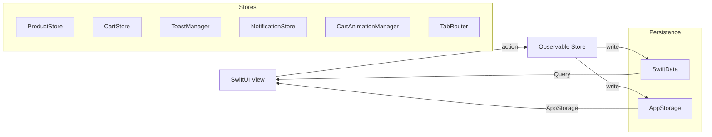

<div align="center">

# GeekCommerz

**Production-grade iOS e-commerce — zero third-party dependencies**

[](https://swift.org)
[](https://developer.apple.com/xcode/swiftui/)
[](https://developer.apple.com/ios/)
[](https://developer.apple.com/xcode/)
[](LICENSE)

*Shop smarter. Earn rewards. Track everything.*

</div>

---

## Architecture



```
geekcommerze/
├── Models/          CartItem · Order · OrderItem · Product
├── Stores/          CartStore · ProductStore
├── Views/           13 screens
├── ToastManager     Toast · HapticFeedback · CartAnimationManager · TabRouter
├── NotificationStore
└── AppConstants     All magic values in one place
```

---

## Feature Map

| Screen | Highlights |
|---|---|
| 🏠 **Home** | Auto-scroll banner · flash sale countdown · skeleton loading · recently viewed |
| 🔍 **Search** | Real-time results · trending chips · recent history (max 8) · category browse |
| 🛒 **Shop** | 2-col grid · sort & filter sheet · long-press context menu · pull-to-refresh |
| 📦 **Product Detail** | Pinch-to-zoom · color/size variants · 30-day price chart · reviews · bundle upsell |
| 🛍 **Cart** | Pill stepper · swipe → wishlist / delete · live shipping threshold |
| 💳 **Checkout** | Saved addresses · promo codes · biometric confirm · Apple Pay (demo) · confetti |
| 📋 **Orders** | Status timeline · reorder · return request (persisted) |
| ❤️ **Wishlist** | Heart toggle from any screen · spring-exit on remove |
| 👤 **Profile** | Loyalty tier · address book · dark mode · stats |
| 🔔 **Notifications** | In-app centre · badge · swipe actions · seeded on first launch |
| 🎬 **Onboarding** | 3-page flow · shown once |
| ✨ **Animations** | Cart fly · heart pulse · filter spring · numeric ticker |

---

## Animations

```
Add to Cart tap
     │
     ▼
[bubble pops in] ──arc up──► [drops into cart tab icon] ──► [fades out]

Heart toggle  →  spring pulse 1.0 → 1.45 → 1.0
Filter chip   →  scale 1.0 → 1.05 + background color spring
Qty stepper   →  numericText content transition + color-flash feedback
Wishlist item →  scale+opacity exit transition on remove
```

---

## Tech Stack

| Layer | Technology |
|---|---|
| UI | SwiftUI 5 |
| Persistence | SwiftData |
| Lightweight state | `@AppStorage` |
| Charts | Swift Charts |
| Biometrics | LocalAuthentication |
| Haptics | UIImpactFeedbackGenerator |
| Concurrency | Swift async/await |
| Architecture | `@Observable` (Observation framework) |
| Testing | Swift Testing + XCUIAutomation |

> **Zero third-party dependencies.**

---

## Promo Codes

| Code | Discount |
|---|---|
| `SAVE10` | 10% off subtotal |
| `SAVE20` | 20% off subtotal |
| `WELCOME5` | $5 flat off |
| `FREESHIP` | Free shipping |

---

## Constants

All magic values live in `AppConstants.swift`:

```swift
AppConstants.StorageKeys.*   // UserDefaults / @AppStorage keys
AppConstants.Loyalty.*       // pointsPerDollar = 10, goldThreshold = 1 000
AppConstants.Shipping.*      // freeThreshold = $50, standardCost = $4.99
AppConstants.PromoCodes.*    // SAVE10 · SAVE20 · WELCOME5 · FREESHIP
AppConstants.App.*           // name · version · privacyURL · termsURL
```

---

## Quick Start

```bash
git clone https://github.com/siraajul/GeekCommerz.git
open GeekCommerz/geekcommerze.xcodeproj
# Press ⌘R — no API keys, no backend, runs fully offline
```

**Requirements:** Xcode 16+ · iOS 17+ · macOS Sonoma 14+

---

## Roadmap

- [ ] Real backend (REST / GraphQL)
- [ ] APNs push notifications
- [ ] AsyncImage from CDN
- [ ] Apple Pay live integration
- [ ] iPad layout
- [ ] Widget extension
- [ ] App Clip

---

<div align="center">

Built with Swift & SwiftUI · Runs entirely on-device

</div>
